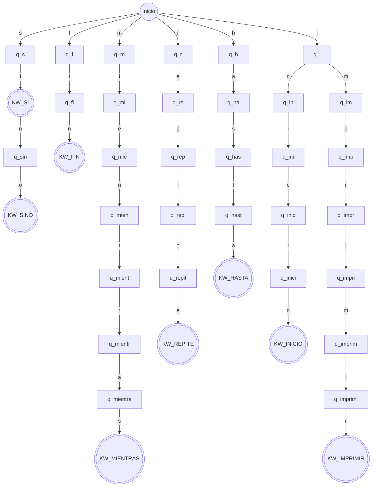

# Proyecto Final: Analizador Léxico (Scanner)

Este proyecto implementa la **Práctica 1** de la materia Lenguajes y Autómatas. Es una aplicación web construida con **Python (Flask)** que simula la primera fase de un compilador.

El programa analiza un texto de entrada ("código fuente") y clasifica cada palabra en tres categorías:

1. **Palabra Clave (KW):** Si pertenece al diccionario definido
2. **Identificador:** Si cumple con la expresión regular `^[a-z][a-z0-9]*$`
3. **Error Léxico:** Si no cumple ninguna de las reglas anteriores

---

## Estructura del Proyecto

```text
/Proyecto1_Scanner
│
├── app.py                # Lógica del servidor Flask y Analizador
├── diccionario.txt       # Base de datos de palabras válidas
├── tokens_salida.txt     # Archivo generado automáticamente (Output)
├── .gitignore            # Archivos ignorados por Git
├── README.md             # Documentación del proyecto
│
├── static/
│   └── style.css         # Hoja de estilos (CSS)
│
└── templates/
    └── index.html        # Interfaz de usuario (HTML)
```

---

## Instalación y Ejecución

### Requisitos Previos
- Python 3.7 o superior
- pip (gestor de paquetes de Python)

### Pasos de Instalación

1. **Clonar el repositorio** (o descargar los archivos)
   ```bash
   git clone <url-del-repositorio>
   cd Proyecto1_Scanner
   ```

2. **Crear y activar el entorno virtual:**
   ```bash
   # Windows
   python -m venv venv
   .\venv\Scripts\activate

   # Mac/Linux
   python3 -m venv venv
   source venv/bin/activate
   ```

3. **Instalar dependencias:**
   ```bash
   pip install flask
   ```

4. **Ejecutar la aplicación:**
   ```bash
   python app.py
   ```

5. **Abrir en el navegador:**
   
   Visita `http://127.0.0.1:5000`

---

## Diseño del Autómata Finito Determinista (DFA)

El siguiente diagrama representa la lógica del autómata utilizado para reconocer las palabras clave. Se utiliza una estructura de árbol (Trie) para optimizar la búsqueda de prefijos comunes.

> **Nota:** Los círculos dobles `(((  )))` representan estados finales (Palabras aceptadas).



---

## Expresiones Regulares Utilizadas

### Identificador
```regex
^[a-z][a-z0-9]*$
```

**Reglas:**
- Debe comenzar con una letra minúscula `[a-z]`
- Puede continuar con cualquier cantidad de letras minúsculas o dígitos `[a-z0-9]*`
- No se permiten mayúsculas ni símbolos especiales (como `_`)

**Ejemplos válidos:** `variable`, `dato1`, `x`, `contador123`

**Ejemplos inválidos:** `Variable`, `1dato`, `dato_1`, `X`

---

## Funcionamiento

1. El usuario ingresa código fuente en el área de texto
2. El analizador divide el texto en tokens individuales
3. Cada token se evalúa contra:
   - El diccionario de palabras clave (usando el DFA/Trie)
   - La expresión regular de identificadores
4. Los resultados se clasifican y muestran en pantalla
5. Se genera automáticamente el archivo `tokens_salida.txt` con los resultados

---

## Palabras Clave Reconocidas

El archivo `diccionario.txt` contiene las siguientes palabras clave:

- `inicio`
- `fin`
- `si`
- `sino`
- `mientras`
- `repite`
- `hasta`
- `imprimir`

---

## 👤 Autores

- **José Antonio Pinto Aguilar - Ana Belen Núñez Hernandez - Hector Emilio Somer Velázquez**
- Matrículas: 233416 - 233385 - 233424
- Materia: Lenguajes y Autómatas
- Institución: UPChiapas

---

## 📄 Licencia

Este proyecto es de carácter académico y fue desarrollado con fines educativos.

---